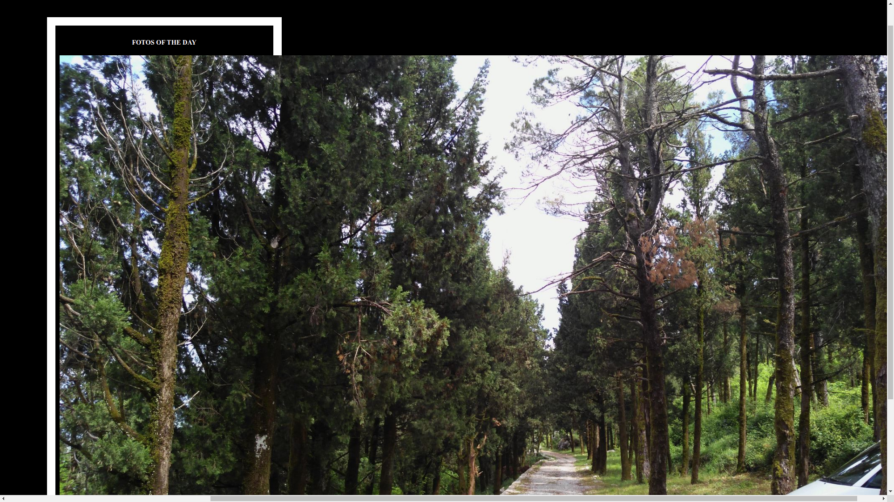
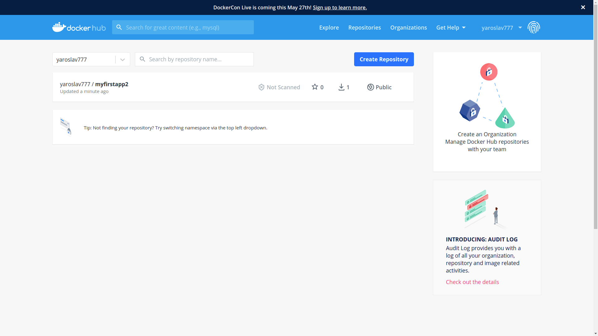

# Task 11

## Docker

__Docker task description.__ Using docker lection2 create a docker image with Python Flask app that displays random cat pix

Docker image with random pix (nature pix)is done and uploaded to DockerHub - my user name yaroslav777

Shot steps review

