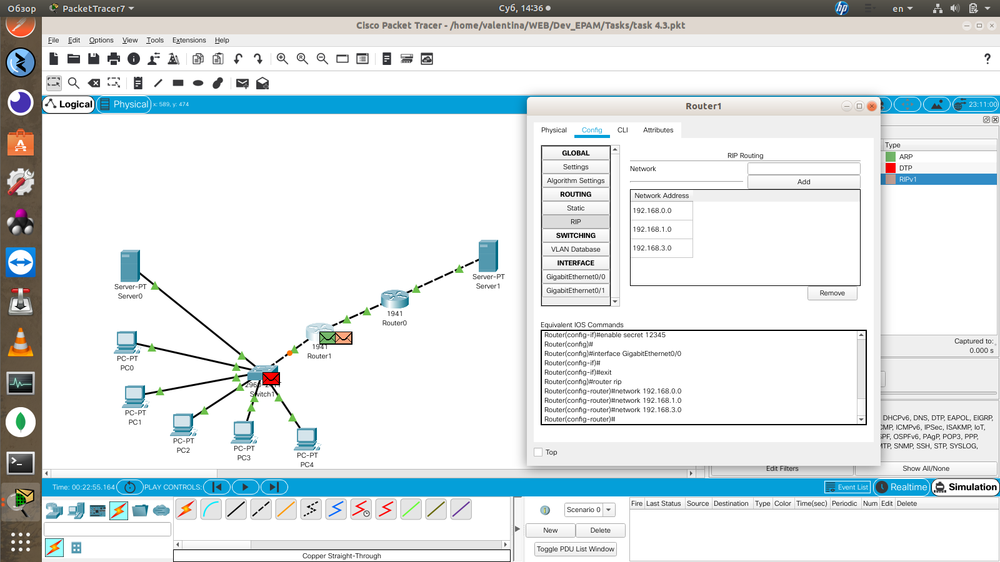

# Task 4.4

## Module 4 Networking Fundamentals

### 4.4.1

Shot review: Between routers connection is made in ip network 10.10.10.1 and 10.10.10.2. And 2 separate network has each router 192.168.0(1).1 and 192.168.3(4). All networks added to RIP.

### 4.4.2

Shot review: Created 2 subnetworks 192.168.0.0 and 192.168.1.0. And 2 servers with DNS 192.168.0.2(www.server1.com) and 192.168.1.2(www.server2.com). Default gateway 192.168.0.10 and 192.168.1.10. Computers 192.168.0.11, 192.168.0.12 and 192.168.1.11, 192.168.1.12.

