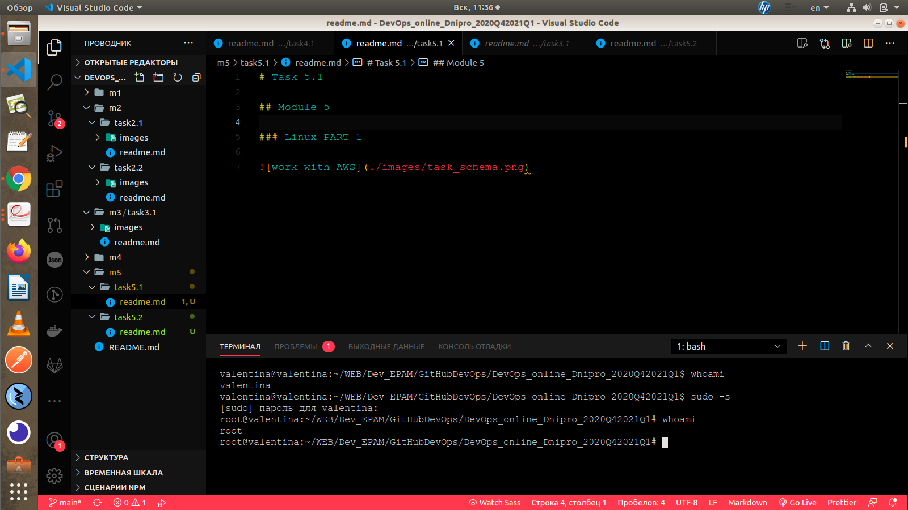

# Task 5.1

## Module 5

### Linux PART 1

It changed file in dir "/etc/passwd"

__help__ is a built-in command in the bash shell (and that shell only) that documents some of the builtin commands and keywords of that shell. That's an internal documentation system of that shell. Other shells have their own documentation system (ksh93 has --help and --man options for its builtins, zsh has a run-help helper that extracts information from manuals in other formats). Other commands like vim have their own embedded documentation system.

__man__ is a system-wide documentation system that provides short reference manuals (pages) for individual commands, API functions, concepts, configuration file syntax, file formats organised in sections (1 for user commands, 2 for system calls...). That's the traditional Unix documentation system.

__info__ is another documentation system originating in the GNU project. It's hypertext with links (predates the web). An info manual is like a digital book with a concept of table of contents and (searchable) index which helps locating the information.

USEFUL: info bash help

USEFUL Link: __The Linux LS Command:__ <https://www.freecodecamp.org/news/the-linux-ls-command-how-to-list-files-in-a-directory-with-options/>

### Linux PART 2

USEFUL Link for tree command: <https://www.tecmint.com/linux-tree-command-examples/>

To determine the file type in Linux, we can use the file command.
$ file README.md
README.md: ASCII text

$ cd - turn to home

List files including hidden files
Type the __ls -a__ command to list files or directories including hidden files or directories. In Linux, anything that begins with a . is considered a hidden file

Type the __ls -l -a or ls -a -l or ls -la or ls -al__ command to list files or directories in a table format with extra information including hidden files or directories.

valentina@valentina:~$ sudo mv /home/valentina/thesis/draft.txt /home
valentina@valentina:~$ sudo mv /home/draft.txt /home/valentina/thesis/draft.txt

__remove safely__ rm -i thesis_backup/quotations.txt
asking for removing: y

#### Determine which partitions are mounted in the system, as well as the types of these partitions

__mount__ for a list of all mounted filesystems and mount options for each of them;
__lsblk__ for a tree of block devices, size and mount point (if mounted);
__df__ for a list of mounted block devices, size, used space, available space and mount point.
