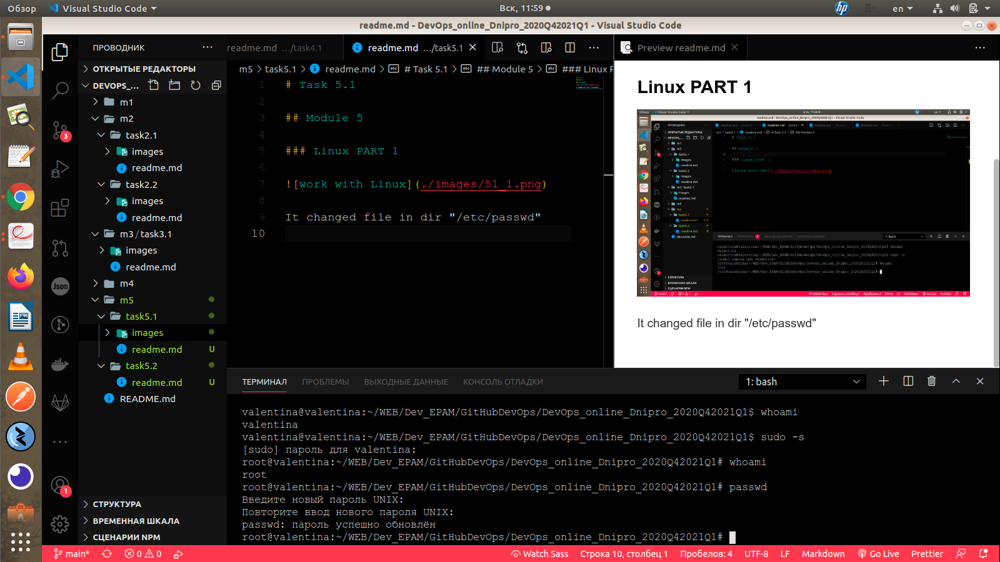

# Task 5.1

## Module 5

### Linux PART 1

It changed file in dir "/etc/passwd"

__help__ is a built-in command in the bash shell (and that shell only) that documents some of the builtin commands and keywords of that shell. That's an internal documentation system of that shell. Other shells have their own documentation system (ksh93 has --help and --man options for its builtins, zsh has a run-help helper that extracts information from manuals in other formats). Other commands like vim have their own embedded documentation system.

__man__ is a system-wide documentation system that provides short reference manuals (pages) for individual commands, API functions, concepts, configuration file syntax, file formats organised in sections (1 for user commands, 2 for system calls...). That's the traditional Unix documentation system.

__info__ is another documentation system originating in the GNU project. It's hypertext with links (predates the web). An info manual is like a digital book with a concept of table of contents and (searchable) index which helps locating the information.