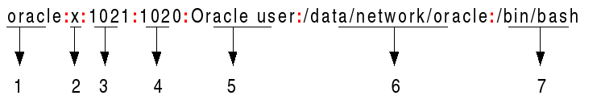
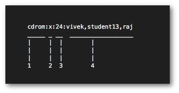

# Task 5.2

## Module 5

### Linux PART 2

Source: <https://www.cyberciti.biz/faq/understanding-etcpasswd-file-format/>

1 Analyze the structure of the /etc/passwd and /etc/group file, what fields are
present in it, what users exist on the system? Specify several pseudo-users, how
to define them?
The /etc/passwd contains one entry per line for each user (user account) of the system. All fields are separated by a colon __: symbol__. Total of seven fields as follows. Generally, /etc/passwd file entry looks as follows:

__1 Username__: It is used when user logs in. It should be between 1 and 32 characters in length.
__2 Password__: An x character indicates that encrypted password is stored in /etc/shadow file. Please note that you need to use the passwd command to computes the hash of a password typed at the CLI or to store/update the hash of the password in /etc/shadow file.
__3 User ID (UID)__: Each user must be assigned a user ID (UID). UID 0 (zero) is reserved for root and UIDs 1-99 are reserved for other predefined accounts. Further UID 100-999 are reserved by system for administrative and system accounts/groups.
__4 Group ID (GID)__: The primary group ID (stored in /etc/group file)
__5 User ID Info__: The comment field. It allow you to add extra information about the users such as user’s full name, phone number etc. This field use by finger command.
__6 Home directory__: The absolute path to the directory the user will be in when they log in. If this directory does not exists then users directory becomes /
__7 Command/shell__: The absolute path of a command or shell (/bin/bash). Typically, this is a shell. Please note that it does not have to be a shell. For example, sysadmin can use the nologin shell, which acts as a replacement shell for the user accounts. If shell set to /sbin/nologin and the user tries to log in to the Linux system directly, the /sbin/nologin shell closes the connection.

Understanding the /etc/group File

It stores group information or defines the user groups i.e. it defines the groups to which users belong. There is one entry per line, and each line has the following format (all fields are separated by a __colon :__

__1 group_name___: It is the name of group. If you run ls -l command, you will see this name printed in the group field.
__2 Password__: Generally password is not used, hence it is empty/blank. It can store encrypted password. This is useful to implement privileged groups.
__3 Group ID (GID)__: Each user must be assigned a group ID. You can see this number in your /etc/passwd file.
__4 Group List__: It is a list of user names of users who are members of the group. The user names, must be separated by commas.
Source <https://www.cyberciti.biz/faq/understanding-etcgroup-file/>

2 What are the uid ranges? What is UID? How to define it?

The system UIDs from 0 to 99 should be statically allocated by the system, and shall not be created by applications.

The system UIDs from 100 to 499 should be reserved for dynamic allocation by system administrators and post install scripts using useradd(1).

3 What is GID? How to define it?

n Unix systems, every user must be a member of at least one group, the primary group, which is identified by the numeric GID of the user's entry in the passwd database, which can be viewed with the command getent passwd (usually stored in /etc/passwd or LDAP). This group is referred to as the primary group ID. A user may be listed as member of additional groups in the relevant entries in the group database, which can be viewed with getent group (usually stored in /etc/group or LDAP); the IDs of these groups are referred to as supplementary group IDs

4 How to determine belonging of user to the specific group?

__groups
groups userName-Here__

5 What are the commands for adding a user to the system? What are the basic
parameters required to create a user?

Creating groups under Linux:
To create groups we’ll use first the command “groupadd” followed by the group’s name. The syntax is: “groupadd __group-name__”.
Creating users under Linux:
Using the command “useradd” we can add a user to our system. The proper syntax is “useradd [options] __username__”

Among the most used options we have:

-g   Main user group (gid)
-d   User Home directory, by default located at /home/__UserName__>
-m  Create Home directory in case it doesn’t exist.
-s   Assign a specific shell to the user, by default it is /bin/bash.

As an example we will create the user nicolas and will assign him the group sector1, also we’ll define the user’s home and shell.

The syntax is:

useradd -g sector1 -d /home/nicolas -m -s /bin/bash nicolas

Command adduser vs useradd
While the command useradd runs a system binary file the command adduser is a perl script to interact with useradd. With the adduser command, the advantage is the home is created automatically. If using the command adduser we need to specify the -m option.

Creating or changing a user password under Linux:
After adding a user with the command “useradd” we need to set a password for the user using the command “passwd”. Remember Linux is case sensitive.

In the following example we’ll create a password for the user nicolas using the following syntax:

passwd nicolas
Then it will request for password and confirmation, after confirmation the password will be established.

6 How do I change the name (account name) of an existing user?
Modifying users under Linux:
We can edit the user’s username, his home directory, his shell and groups to which he belongs among more options. For this we’ll use the command “usermod”.

As an example we’ll modify the user nicholas’ home directory which we previously defined as /home/nicolas and we’ll replace it for /home/nico1.

To do it run:

usermod -d /home/nico1 nicolas
The previous command updated the user’s home.

7 What is skell_dir? What is its structure?
skel is derived from the skeleton because it contains basic structure of home directory
The /etc/skel directory contains files and directories that are automatically copied over to a new user’s when it is created from useradd command.

8 How to remove a user from the system (including his mailbox)?
Deleting users under Linux:
We can remove a user with the command userdel followed by the username. We can also combine parameters, among most used options we have:

-f remove user files.
-r remove user home and mail tail.

In the following example we’ll delete the user account “ivan”

userdel ivan
__Note:  The command “userdel” won’t remove the user if is running process.__

9 What commands and keys should be used to lock and unlock a user account?
One of the simplest ways to lock an account is with the passwd -l command. For example:

$ sudo passwd -l tadpole
The effect of this command is to insert an exclamation point as the first character in the encrypted password field in the /etc/shadow file. This is enough to keep the password from working. What previously looked like this (note the first character).

$ sudu chage -E0 tadpole
$ sudo passwd -S tadpole
tadpole P 10/15/2019 0 99999 7 -1
The chage command is going to make a subtle change to the /etc/shadow file. The eighth field in that colon-separated file (shown below) will be set to zero (previously empty) and this means the account is essentially expired. The chage command tracks the number of days between password changes, but also provides account expiration information when this option is used. A zero in the eiighth field would mean that the account expires a day after January 1, 1970, but also simply locks it when a command like that shown above is used.
Source <https://www.networkworld.com/article/3513982/locking-and-unlocking-accounts-on-linux-systems.html>

10 How to remove a user's password and provide him with a password-free
login for subsequent password change?
Using passwd Command
To force a user to change his/her password, first of all the password must have expired and to cause a user’s password to expire, you can use the passwd command, which is used to change a user’s password by specifying the -e or --expire switch along with username as shown.

__passwd --expire ravi__
Next verify the user ravi’s password expiration and aging information with the chage command as shown.
__chage -l ravi__

Using chage Command
Alternatively, you can use the chage command, with the -d or --lastday option which sets the number of days since January 1st, 1970 when the password was last changed.

Now to set the password expiry of user, run the following command by specifying the day to zero (0), means that the password has not been changed since the above date (i.e. January 1st, 1970), so the password has literally expired and needs to be changed immediately before the user can access the system again.

__chage --lastday 0 ravi__
OR
__chage --lastday 1970-01-01 ravi__
Next check the user ravi’s password expiration and aging information with the chage command using -l option as shown.
__chage -l ravi__

11 Display the extended format of information about the directory, tell about
the information columns displayed on the terminal.
ls is one of the basic commands that any Linux user should know.

The ls command lists files and directories within the file system, and shows detailed information about them. It is a part of the GNU core utilities package which is installed on all Linux distributions.

This article will show you how to use the ls command through practical examples and detailed explanations of the most common ls options.

How to Use the ls Command
The syntax for the ls command is as follows:

ls [OPTIONS] [FILES]
When used with no options and arguments, ls displays a list of the names of all files in the current working directory.
Long Listing Format
The default output of the ls command shows only the names of the files and directories, which is not very informative.

The -l ( lowercase L) option tells ls to print files in a long listing format.

When the long listing format is used, you can see the following file information:
The file type.
The file permissions.
Number of hard links to the file.
File owner.
File group.
File size.
Date and Time.
File name.
Let’s explain the most important columns of the output.

The first character shows the file type. In this example, the first character is -, which indicates a regular file. Values for other file types are as follows:
__- - Regular file.
b - Block special file.
c - Character special file.
d - Directory.
l - Symbolic link.
n - Network file.
p - FIFO.
s - Socket.__
The next nine characters are showing the file permissions. The first three characters are for the user, the next three are for the group, and the last three are for others. You can change the file permissions with the chmod command. The permission character can take the following value:

r - Permission to read the file.
w - Permission to write to the file.
x - Permission to execute the file.
s - setgid bit.
t - sticky bit.
In our example, rw-r--r-- means that the user can read and write the file, and the group and others can only read the file. The number 1 after the permission characters is the number of hard links to this file.

The next two fields root root are showing the file owner and the group, followed by the size of the file (337), shown in bytes. Use the -h option if you want to print sizes in a human-readable format. You can change the file owner using the chown command.

Oct 4 11:31 is the last file modification date and time.

The last column is the name of the file.

Source <https://linuxize.com/post/how-to-list-files-in-linux-using-the-ls-command/>

12 What access rights exist and for whom (i. e., describe the main roles)?
Briefly describe the acronym for access rights.
Linux is a multiuser system and that each user belongs to one primary group and possibly additional groups. It is also possible to log in as one user and become another user using the su or sudo-s commands. Ownership of files in Linux and access authority are closely related to user ids and groups.
The Linux permissions model has two special access modes called suid (set user id) and sgid (set group id). When an executable program has the suid access modes set, it will run as if it had been started by the file’s owner, rather than by the user who really started it. Similarly, with the sgid access modes set, the program will run as if the initiating user belonged to the file’s group rather than to his own group. Either or both access modes may be set.
r (4) - read;
w (2) - write;
x (1) - execute;

13 What is the sequence of defining the relationship between the file and the
user?
In Linux, each and every file is owned by a single user and a single group, and has its own access permissions. Let’s look at how to view the ownership and permissions of a file.

The most common way to view the permissions of a file is to use ls with the long listing option, e.g. ls -l myfile. If you want to view the permissions of all of the files in your current directory, run the command without an argument, like this:

ls -l
Hint: If you are in an empty home directory, and you haven’t created any files to view yet, you can follow along by listing the contents of the /etc directory by running this command: ls -l /etc

Here is an example screenshot of what the output might look like, with labels of each column of output:

Source <https://www.digitalocean.com/community/tutorials/an-introduction-to-linux-permissions>

14 What commands are used to change the owner of a file (directory), as well
as the mode of access to the file? Give examples, demonstrate on the terminal.
Changing File Ownership
This section describes how to change the ownership and group ownership of a file.

By default, the owner cannot use the chown command to change the owner of a file or directory. However, you can enable the owner to use the chown command by adding the following line to the system's /etc/system file and rebooting the system.

set rstchown = 0
How to Change the Owner of a File
Use the following procedure to change the ownership of a file.

Become superuser or assume an equivalent role.

Change the owner of a file by using the chown command.

__# chown new-owner  filename__
new-owner

Specifies the user name or UID of the new owner of the file or directory.  

filename

Specifies the file or directory.

Verify that the owner of the file has changed.
__# ls -l filename__

15 What is an example of octal representation of access rights? Describe the
umask command.
Specifying the file creation mask using numeric representation
The file creation mask can also be represented numerically, using octal values (the digits from 0 to 7). When using octal numeric representation, certain numbers represent certain permissions, and these numbers are added or subtracted from each other to represent the final, combined permissions value. Specifically, the numbers 1, 2, and 4 represent the following permissions:

number permission
4 read
2 write
1 exeFor each class of user, one digit can be used to represent their permissions; using the example above, we could represent the symbolic permission of rwxr-xr-- using the three-digit octal number 754. The order of the digits is always the same: User, Group, Other.cute
To view your system's current umask value, enter the command:

umask
o view this as a symbolic representation, use the -S flag:

umask -S
Here are some other example umask commands:

umask a+r
Sets the mask so that new files will allow all users to read them; other permissions will be unchanged from the default.

umask a-x

Sets the mask so that new files will not initially be executable by any user; other default permissions unchanged from defaults.

umask u=rw,go=

Sets the mask so that new files will be readable and writable by the user who owns the file, but may not be executed; group members and others will have no permissions to access the file.

umask 777
Make new files inaccessible to everyone - no one can read, write, or execute them.

umask 000
Make new files completely accessible (read, write, and execute) to absolutely everyone. However, this is a bad idea. Don't do this.

16 Give definitions of sticky bits and mechanism of identifier substitution. Give
an example of files and directories with these attributes.

1. Set the sticky bit on Directory
The example below enables the sticky bit on a directory.

Use chmod command to set the sticky bit. If you are using the octal numbers in chmod, give 1 before you specify other numbered privileges, as shown below. The example below, gives rwx permission to user, group and others (and also adds the sticky bit to the directory).

$ chmod 1777 dir
Or, you can assign only sticky bit to an existing directory (without touching any other user, group and other privileges) using chmod command as shown below.

$ chmod +t dir
Once the sticky bit is assigned to a directory, you’ll see (t) as the last character in the permission. In this example, it is drwxrwxrwt.

$ ls -ld /home/bala/dir
drwxrwxrwt 2 bala bala 4096 2011-01-28 14:09 /home/bala/dir
$ ls -l dir
total 8
-rwxrwxrwx 1 bala   bala   20 2011-01-28 14:12 bala.txt
-rwxrwxrwx 1 guest guest 41 2011-01-28 14:13 guest.txt
In the above example, as dir has rwx permission to everybody, all other users are allowed to do create their files or directories under this directory. However, even when the sub-directories or files under dir is having rwx permission to everybody, only the owner of those can delete or rename those files and directory. Other users cannot delete or rename it because of sticky bit.

In the above example, bala.txt has rwx to users, groups, and others. But, when guest user is trying to delete the file bala.txt, he’ll see the “Operation not permission” message as shown below.

$ su guest
Password:
$ cd /home/bala/dir1
$ rm bala.txt
rm: cannot remove `bala.txt': Operation not permitted
Please note that /tmp has sticky bit enabled by default. You might have not noticed that until now. Now you know why /tmp directory is supposed to have sticky bit enabled.

$ ls -ld /tmp
drwxrwxrwt 3 root root 4096 Jan 31 08:29 /tmp
To remove the sticky bit from a directory, do the following.

$ chmod -t dir
2. Set the sticky bit on File
Setting the sticky bit on a file is pretty much useless, and it doesn’t do anything. On some of the older *nix flavors, a sticky bit enabled executable file will be loaded to the swap memory after 1st execution, which speeds up all subsequent execution. This is not true anymore.

17 What file attributes should be present in the command script?
The procedure to run the .sh file shell script on Linux is as follows:

Set execute permission on your script:
chmod +x script-name-here.sh
To run your script, enter:
./script-name-here.sh
Another option is as follows to execute shell script:
sh script-name-here.sh
ORbash script-name-here.sh
The procedure to run the .sh file shell script on Linux is as follows:

Set execute permission on your script:
chmod +x script-name-here.sh
To run your script, enter:
./script-name-here.sh
Another option is as follows to execute shell script:
sh script-name-here.sh
ORbash script-name-here.sh
