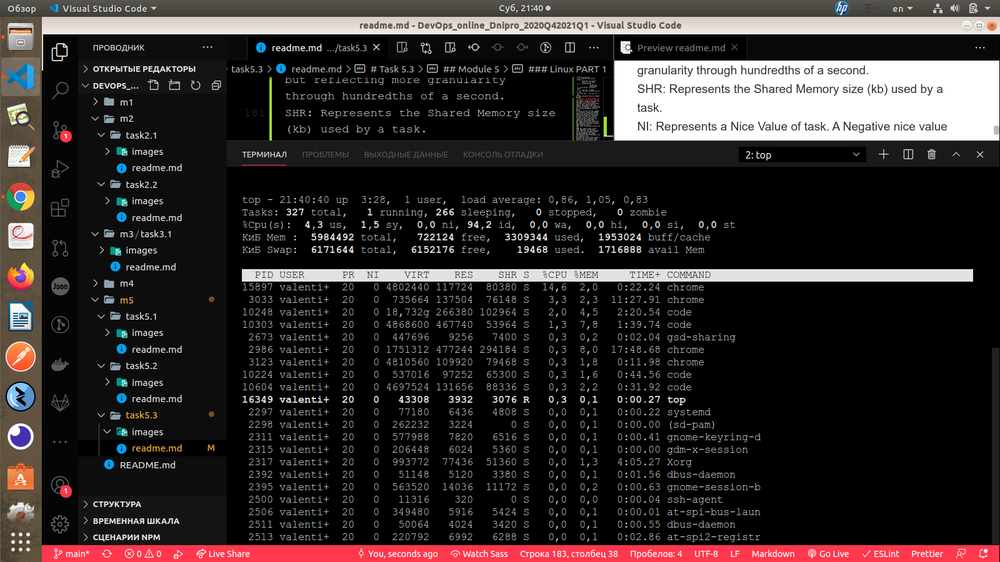

# Task 5.3

## Module 5

### Linux PART 1

1. How many states could has a process in Linux?
[info](https://medium.com/@cloudchef/linux-process-states-and-signals-a967d18fab64)
Linux has basically 5 states:
Running/Runnable (R): running processes are processes using a CPU core right now, a runnable process is a process that has everything to run and is just waiting for a CPU core slot.
Sleeping: a sleeping process is a process waiting for a resource to be available (for example, a I/O operation to complete) or an event to happen (like a certain amount of time to pass). The difference between process in Interruptible Sleep (S) state and Uninterruptible Sleep (D) is that the former will wake up to handle signals while the former won't. We'll talk about signals in a moment, but let's suppose that a process is waiting for a I/O operation to complete before wake up. If in the meantime, it receives a signal to terminate (SIGKILL), it will terminate before having the chance to handle the requested data. That's why I/O operations normally go to uninterruptible sleep while waiting for the result: they will wake up with when the operation is ready, handle the result and, only then, check for any pending signal to handle. Processes that can be terminated before the wake up condition is fulfilled without any consequence usually go to interruptible sleep instead.
Stopped (T): a process becomes stopped when it receives the SIGSTOP signal (not unlike when you press ctrl+z in the shell, although ctrl+z sends a SIGTSTP instead). When stopped, the process execution is suspended and the only signals it will handle are SIGKILL and SIGCONT. The former will remove the process permanently, while the later will put the process back to the Running/Runnable state (like when you run fg or bg after pressing ctrl+z in the shell).
Zombie (Z): we briefly talked about zombie processes when we discussed system calls. When a process finishes with exit() system call, its state needs to be "reaped" by its parent (calling wait()); in the meantime, the child process remains in zombie state (not alive nor dead).
2. Examine the pstree command. Make output (highlight) the chain (ancestors) of the current
process.
[info](https://linuxize.com/post/pstree-command-in-linux/)
It is similar to ps , but instead of listing the running processes, it shows them in a tree. The tree-like format is a more convenient way to display the processes hierarchy and makes the output more visually appealing.

How to Use the pstree Command
The general syntax for the pstree command is as follows:

ps [OPTIONS] [USER or PID]
Copy
In it’s simplest form when invoked without any option or argument, pstree displays a hierarchical tree structure of all running processes:

pstree

Highlighting
pstree also allows you to highlight processes for better visual representation.

The -h option instructs pstree to highlight the current process and all its ancestors.
pstree -h
To highlight a specific process, use the -H option followed by the process ID:

pstree -H PID_NUMBER
If the highlighting is not supported, the command will exit with an error.

Conclusion
The pstree command displays the running processes in the form of a tree structure.

For information about all available pstree options, type man pstree in your terminal.
3. What is a proc file system?
[Info](https://www.geeksforgeeks.org/proc-file-system-linux/)
Proc file system (procfs) is virtual file system created on fly when system boots and is dissolved at time of system shut down.

It contains the useful information about the processes that are currently running, it is regarded as control and information centre for kernel.

The proc file system also provides communication medium between kernel space and user space.
4. Print information about the processor (its type, supported technologies, etc.).
[Info](https://www.tecmint.com/check-linux-cpu-information/)
Get CPU Info Using cat Command.
lscpu Command – Shows CPU Architecture Info.
cpuid Command – Shows x86 CPU.
dmidecode Command – Shows Linux Hardware Info.
Inxi Tool – Shows Linux System Information.
lshw Tool – List Hardware Configuration.
hardinfo – Shows Hardware Info in GTK+ Window.
hwinfo – Shows Present Hardware Info.
nproc – Print Number of Processing Units.
5. Use the ps command to get information about the process. The information should be as
follows: the owner of the process, the arguments with which the process was launched for
execution, the group owner of this process, etc.
[info](https://linuxhint.com/ps_command_linux/)
The full form of ps is process status. It is a command used to find information about currently running processes on Linux. ps is a very important command of Linux.In this article, I will show you how to use the ps command to find running processes on Linux.
6. How to define kernel processes and user processes?
[info](https://www.geeksforgeeks.org/user-mode-and-kernel-mode-switching/?ref=rp)
The User mode is normal mode where the process has limited access. While the Kernel mode is the privileged mode where the process has unrestricted access to system resources like hardware, memory, etc. A process can access I/O Hardware registers to program it, can execute OS kernel code and access kernel data in Kernel mode. Anything related to Process management, IO hardware management, and Memory management requires process to execute in Kernel mode.
7. Print the list of processes to the terminal. Briefly describe the statuses of the processes.
What condition are they in, or can they be arriving in?
[info](https://www.hostinger.com/tutorials/vps/how-to-manage-processes-in-linux-using-command-line)
There are several commands that you can use to list running processes: ps, top, and htop.
You can use ps aux to get more in-depth information about your running processes. Here’s a breakdown of each argument:

a option outputs all running processes of all users in the system.
u option provides additional information like memory and CPU usage percentage, the process state code, and the owner of the processes.
x option lists all processes not executed from the terminal. A perfect example of this are daemons, which are system-related processes that run in the background when the system is booted up.
Aside from those two options, here are some other common examples of the ps command that list running processes in Linux:

ps -u [username] lists all running processes of a certain user.
ps -e or ps -A displays active Linux processes in the generic UNIX format.
ps -T prints active processes that are executed from the terminal.
Ps -C process_name will filter the list by the process name. In addition, this command also shows all child processes of the specified process.
The top command is used to discover resource-hungry processes. This Linux command will sort the list by CPU usage, so the process which consumes the most resources will be placed at the top.

Unlike the ps command, the output of the top command is updated periodically. That means you’ll see real-time updates for CPU usage and running time.
__Keys Functions
k Kills a process
M Sorts the list by memory usage.
N Sorts the list by PID.
r Changes the priority of a process.
h Displays the help window.
z Displays running processes in colors.
d Changes the refresh time interval.
c Displays the absolute path of a process.__
Running “htop” Command.
If you use Ubuntu, you can install htop by running the following command:

__sudo apt-get install htop__
Keys Functions
F9 To kill a process.
F8 Increase the priority of a process.
F7 Decrease the priority of a process.
F6 Sort processes by any column.
F5 Display processes in a tree view.
F4 Filter the processes by name.
F3 Search for a process.
F2 Open htop setup.
F1 Display the help menu.
Conclusion
It is important to know how to list all running processes in your Linux operating system. The knowledge will be useful when you need to manage processes.

Let’s take a look once more at the three commands that you can use to list Linux processes:

ps command — outputs a static view of all processes.
top command — displays the real-time list of all running processes.
htop command — shows the real-time result and is equipped with user-friendly features.
8. Display only the processes of a specific user.
[info](https://www.cyberciti.biz/faq/linux-list-processes-by-user-names-euid-and-ruid/)
Introduction – A Linux process is nothing but running instance of a program. For example, when you start Firefox to browse Internet, you can create a new process. In Linux, each process is given a unique number called as a process identification (PID). Linux kernel makes sure that each process gets a unique PID. /sbin/init or /lib/systemd/systemd on modern Linux distros always has a PID of 1 because it is eternally the first process on the Linux based system. The ps command used to list the currently running processes and their PIDs on Linux.
Linux list processes by user names
The procedure to view process created by the specific user in Linux is as follows:

Open the terminal window or app
To see only the processes owned by a specific user on Linux run: ps -u {USERNAME}
Search for a Linux process by name run: pgrep -u {USERNAME} {processName}
Another option to list processes by name is to run either top -U {userName} or htop -u {userName} commands
Let us see examples in details to show all processes for a specific user on Linux.

How to see process created by a specific user in Linux
See all process crated by user named tom:
ps -u tom

OR
ps -U tom

EUID is the Effective User ID. The effective user ID describes the user whose file access permissions are used by the process. RUID is the Real User ID. The real user ID identifies the user who created the process. So:

-u tom : Show all processes by RUID
-U tom : Display all processes by EUID
You can get a list of every process running as vivek (real [RUID] & effective ID [EUID]) in user format:
ps -U vivek -u vivek
ps -U vivek -u vivek u
__see all process run by, qemu and postfix users__

ps -U qemu -u qemu
ps -U postfix -u postfix
ps -U postfix -u postfix u
How to show all processes for a specific user using top/htop
The syntax is pretty simple to see all processes created by a user named vivek:
top -U vivek
9. What utilities can be used to analyze existing running tasks (by analyzing the help for the ps
command)?
[info](https://www.tecmint.com/command-line-tools-to-monitor-linux-performance/)
[info](https://www.tecmint.com/ps-command-examples-for-linux-process-monitoring/)
Использование:
 ps [опции]

Выбор по списку:
 -C <команда>         имя команды
 -G, --Group GID    real group id or name
 -g, --group group session or effective group name
 -p, p, --pid PID  идентификатор процесса
        --ppid PID  идентификатор родительского процесса
 -q, q, --quick-pid PID
                      process id (quick mode)
 -s, --sid session  идентификатор сеанса
 -t, t, --tty tty   терминал
 -u, U, --user UID  effective user id or name
 -U, --User UID     real user id or name
10. What information does top command display?
[info](https://www.geeksforgeeks.org/top-command-in-linux-with-examples/)
top command is used to show the Linux processes. It provides a dynamic real-time view of the running system. Usually, this command shows the summary information of the system and the list of processes or threads which are currently managed by the Linux Kernel.
As soon as you will run this command it will open an interactive command mode where the top half portion will contain the statistics of processes and resource usage. And Lower half contains a list of the currently running processes. Pressing q will simply exit the command mode.
PID: Shows task’s unique process id.
PR: Stands for priority of the task.
SHR: Represents the amount of shared memory used by a task.
VIRT: Total virtual memory used by the task.
USER: User name of owner of task.
%CPU: Represents the CPU usage.
TIME+: CPU Time, the same as ‘TIME’, but reflecting more granularity through hundredths of a second.
SHR: Represents the Shared Memory size (kb) used by a task.
NI: Represents a Nice Value of task. A Negative nice value implies higher priority, and positive Nice value means lower priority.
%MEM: Shows the Memory usage of task.
11. Display the processes of the specific user using the top command.

12. What interactive commands can be used to control the top command? Give a couple of
examples.
[info](https://www.computerhope.com/unix/top.htm)
-h | -v Help/Version

Show library version and the usage prompt, then quit.
-b Batch-mode operation

Starts top in 'Batch' mode, which could be useful for sending output from top to other programs or to a file. In this mode, top will not accept input and runs until the iterations limit you've set with the '-n' command-line option, or until killed.
-c Command-line/Program-name toggle

Starts top with the last remembered 'c' state reversed. Thus, if top was displaying command lines, now that field will show program names, and visa versa. See the 'c' interactive command for additional information.
-d interval Delay-time, where interval is represented as: ss.tt (secs.tenths)

Specifies the delay between screen updates, and overrides the corresponding value in one's personal configuration file or the startup default. Later this can be changed with the 'd' or 's' interactive commands.

Fractional seconds are honored, but a negative number is not allowed. In all cases, however, such changes are prohibited if top is running in 'Secure mode', except for root (unless the 's' command-line option was used).
-H Threads-mode operation

Instructs top to display individual threads. Without this command-line option a summation of all threads in each process is shown. Later this can be changed with the 'H' interactive command.
-i Idle-process toggle

Starts top with the last remembered 'i' state reversed. When this toggle is Off, tasks that have not used any CPU since the last update will not be displayed.
-n limit Number of iterations

Specifies the maximum number of iterations, or frames, top should produce before ending.
-ppid Monitor-PIDs mode, specified as: -ppid1 -ppid2 ... or -ppid1,pid2,pid3 ...

Monitor only processes with specified process IDs. This option can be given up to 20 times, or you can provide a comma delimited list with up to 20 pids. Co-mingling both forms is permitted.

A pid value of zero will be treated as the process id of the top program itself (once it is running).

This command-line option only and should you want to return to normal operation, it is not necessary to quit and restart top -- just issue any of these interactive commands: '=', 'u' or 'U'.

The 'p', 'u' and 'U' command-line options are mutually exclusive.
-s Secure-mode operation

Starts top with secure mode forced, even for root. This mode is far better controlled through the system configuration file (see topic 6. FILES).
-S Cumulative-time toggle

Starts top with the last remembered 'S' state reversed. When 'Cumulative time' mode is On, each process is listed with the cpu time that it and its dead children have used. See the 'S' interactive command for additional information regarding this mode.
-u|-U user-id-or-name User-filter-mode

Display only processes with a user id or user name matching that given. The '-u' option matches the effective user whereas the '-U' option matches on any user (real, effective, saved, or filesystem).

The 'p', 'u' and 'U' command-line options are mutually exclusive.
-w number Output-width-override

In 'Batch' mode, when used without an argument top will format output using the COLUMNS= and LINES= environment variables, if set. Otherwise, width will be fixed at the maximum 512 columns. With an argument, output width can be decreased or increased (up to 512) but the number of rows is considered unlimited.

In normal display mode, when used without an argument top will attempt to format output using the COLUMNS= and LINES= environment variables, if set. With an argument, output width can only be decreased, not increased. Whether using environment variables or an argument with -w, when not in 'Batch' mode actual terminal dimensions can never be exceeded.

Note: Without the use of this command-line option, output width is always based on the terminal at which top was invoked whether or not in 'Batch' mode.
13. Sort the contents of the processes window using various parameters (for example, the
amount of processor time taken up, etc.)
[info](https://man7.org/linux/man-pages/man1/top.1.html)
14. Concept of priority, what commands are used to set priority?
[info](https://www.tecmint.com/set-linux-process-priority-using-nice-and-renice-commands/)
There are a total of 140 priorities and two distinct priority ranges implemented in Linux. The first one is a nice value (niceness) which ranges from -20 (highest priority value) to 19 (lowest priority value) and the default is 0, this is what we will uncover in this guide. The other is the real-time priority, which ranges from 1 to 99 by default, then 100 to 139 are meant for user-space.

One important characteristic of Linux is dynamic priority-based scheduling, which allows the nice value of processes to be changed (increased or decreased) depending on your needs, as we’ll see later on.

How to Check Nice Value of Linux Processes
To see the nice values of processes, we can use utilities such as ps, top or htop.

To view processes nice value with ps command in user-defined format (here the NI the column shows the niceness of processes).
15. Can I change the priority of a process using the top command? If so, how?
You can change its priority with the renice command in this form:

renice -n  -12  -p 1055
renice -n -2  -u apache
__Any changes you make with renice command to a user’s processes nice values are only applicable until the next reboot.__
16. Examine the kill command. How to send with the kill command
process control signal? Give an example of commonly used signals.
[info](https://www.tecmint.com/find-and-kill-running-processes-pid-in-linux/)
When killing processes, the kill command is used to send a named signal to a named process or groups of processes. The default signal is the TERM signal.

__pidof vlc
kill -SIGTERM 9541__

Remember that the kill command can be a built-in function in many modern shells or external located at /bin/kill.
17. Commands jobs, fg, bg, nohup. What are they for? Use the sleep, yes command to
demonstrate the process control mechanism with fg, bg.
__jobs, fg, bg — управление фоновыми процессами__
[info](https://habr.com/ru/post/112539/)

### Linux part 2

Part2

1. Check the implementability of the most frequently used OPENSSH commands in the MS
Windows operating system. (Description of the expected result of the commands +
screenshots: command – result should be presented)
[info](https://docs.microsoft.com/en-us/windows-server/administration/openssh/openssh_overview)
2. Implement basic SSH settings to increase the security of the client-server connection.
[info](https://www.cyberciti.biz/tips/linux-unix-bsd-openssh-server-best-practices.html)
1 - Use SSH public key based login
2 - Disable root user login
3 - Disable password based login
4 - Limit Users’ ssh access
5 - Disable Empty Passwords
6 - Use strong passwords and passphrase for ssh users/keys
7 - Firewall SSH TCP port # 22
8 - Change SSH Port and limit IP binding
9 - Use TCP wrappers (optional)
10 - Thwart SSH crackers/brute force attacks
11 - Rate-limit incoming traffic at TCP port # 22 (optional)
12 - Use port knocking (optional)
13 - Configure idle log out timeout interval
14 - Enable a warning banner for ssh users
15 - Disable .rhosts files (verification)
16 - Disable host-based authentication (verification)
17 - Patch OpenSSH and operating systems
18 - Chroot OpenSSH (Lock down users to their home directories)
19 - Disable OpenSSH server on client computer
3. List the options for choosing keys for encryption in SSH. Implement 3 of them.
[info](https://www.ssh.com/ssh/keygen/)
Choosing an Algorithm and Key Size
SSH supports several public key algorithms for authentication keys. These include:

rsa - an old algorithm based on the difficulty of factoring large numbers. A key size of at least 2048 bits is recommended for RSA; 4096 bits is better. RSA is getting old and significant advances are being made in factoring. Choosing a different algorithm may be advisable. It is quite possible the RSA algorithm will become practically breakable in the foreseeable future. All SSH clients support this algorithm.

dsa - an old US government Digital Signature Algorithm. It is based on the difficulty of computing discrete logarithms. A key size of 1024 would normally be used with it. DSA in its original form is no longer recommended.

ecdsa - a new Digital Signature Algorithm standarized by the US government, using elliptic curves. This is probably a good algorithm for current applications. Only three key sizes are supported: 256, 384, and 521 (sic!) bits. We would recommend always using it with 521 bits, since the keys are still small and probably more secure than the smaller keys (even though they should be safe as well). Most SSH clients now support this algorithm.

ed25519 - this is a new algorithm added in OpenSSH. Support for it in clients is not yet universal. Thus its use in general purpose applications may not yet be advisable.

The algorithm is selected using the -t option and key size using the -b option. The following commands illustrate:

ssh-keygen -t rsa -b 4096
ssh-keygen -t dsa
ssh-keygen -t ecdsa -b 521
ssh-keygen -t ed25519
4. Implement port forwarding for the SSH client from the host machine to the guest Linux
virtual machine behind NAT.
[info](https://medium.com/platform-engineer/port-forwarding-for-ssh-http-on-virtualbox-459277a888be)
5*. Intercept (capture) traffic (tcpdump, wireshark) while authorizing the remote client on the
server using ssh, telnet, rlogin. Analyze the result.
