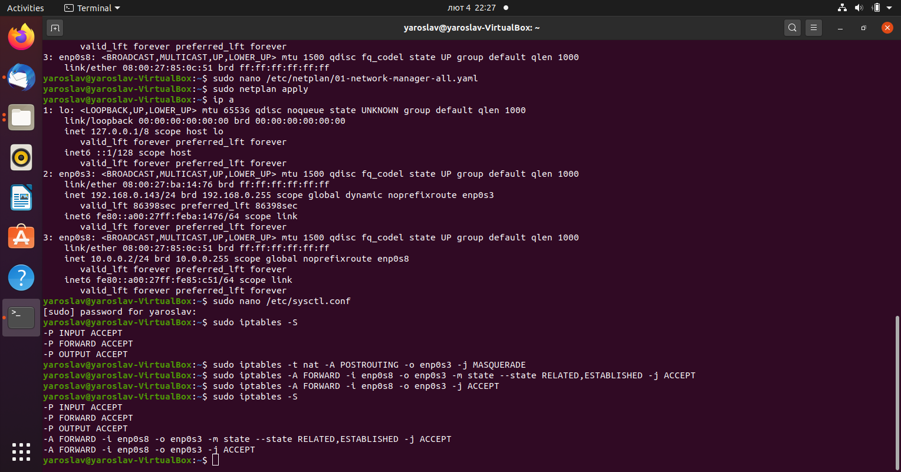
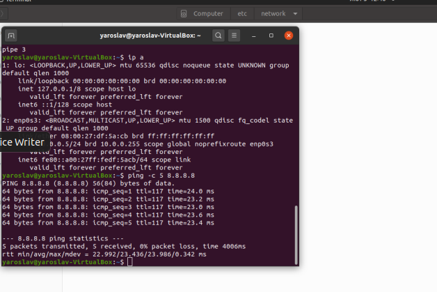
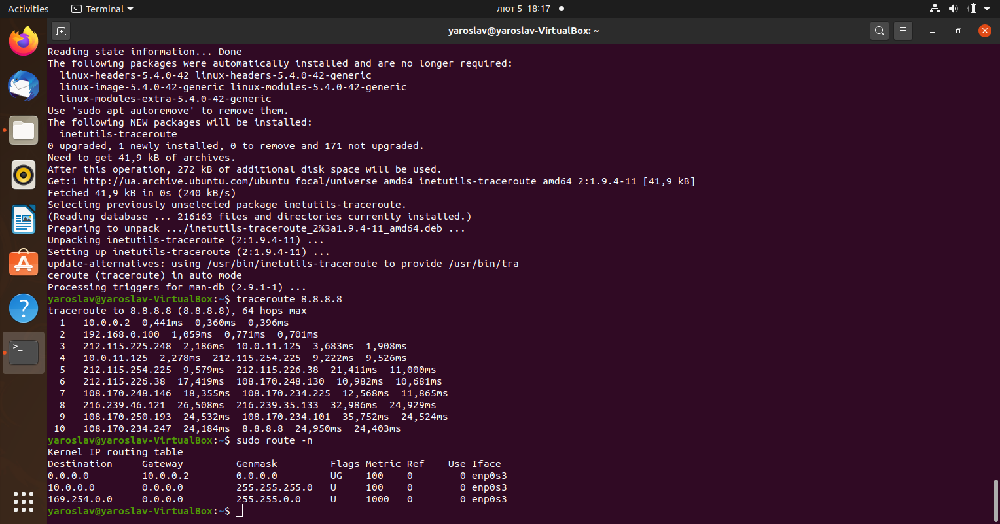

# Task 6.1

## Module 6

### Networking with Linux

Shot steps of creating virtual machines connection.
VM 1 that has 2 adapters

VM 2 that connect to VM1 and then to Host with ping to Google (8.8.8.8)

Determine the default gateway for your HOST and display routing table and trace the route to google.com.

Determine, which IP address belongs to resource epam.com.
__host epam.com | grep "has address" | sed 's/has address/-/g'
epam.com - 3.214.134.159__
