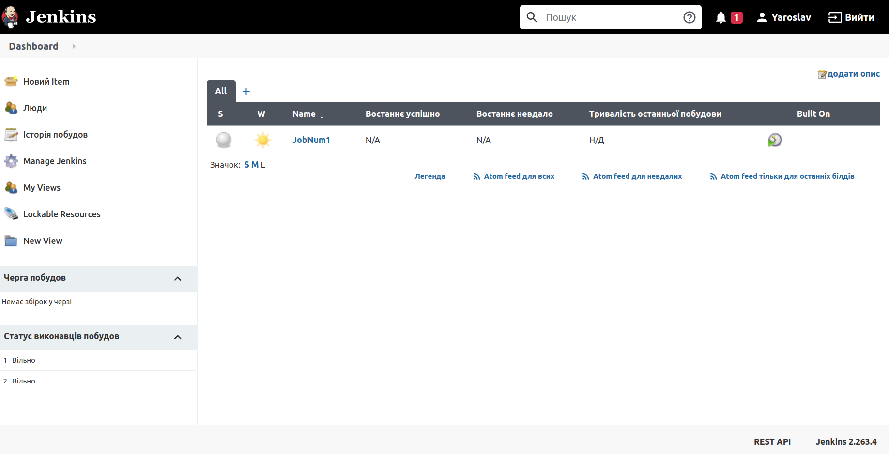

# Task 8

## Jenkins

Create some templates using lection materials about Jenkins according your final task.
More detailed: choose the content part for your final task (simple web page, web application, etc) and
programming language (java, js, python, etc), and type of delivery/deployment mechanism.

__Shot review:
Created 2 jobs, 1 - test, 2 - template for final task.
The main goal is to push source code from GitHub to Heroku. Authorisation to Heroku is done (with SSH). Next is creat Docker with app and published un GitHub.__

